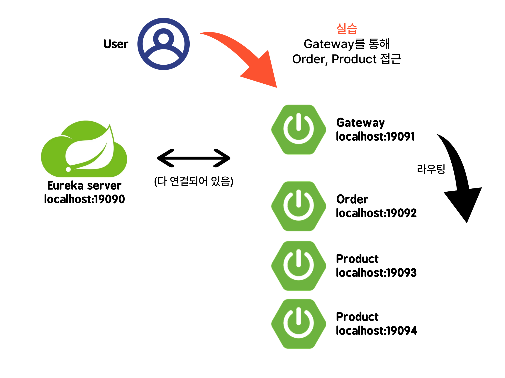
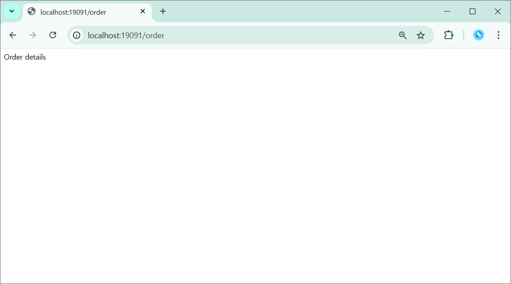
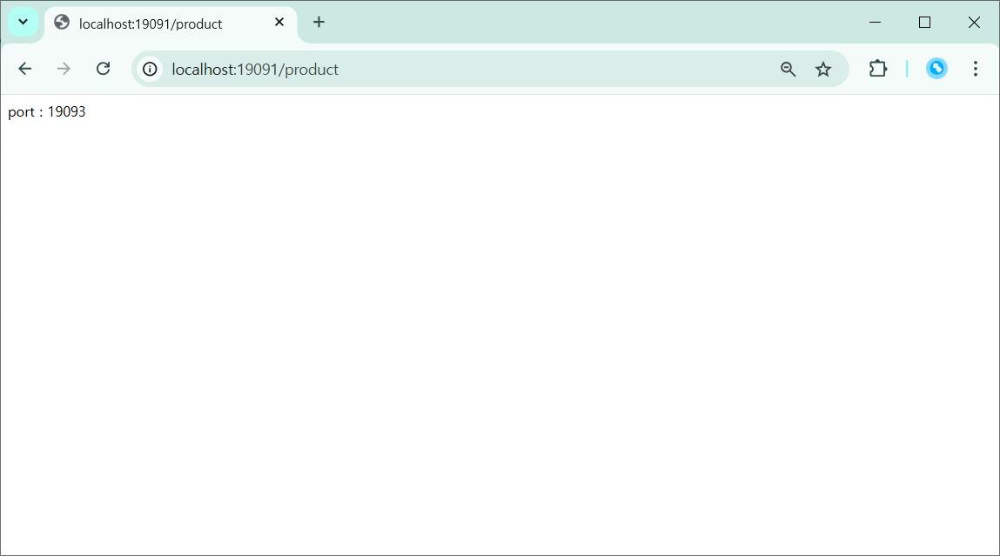

# API Gateway API 게이트웨이
- 여러 개의 마이크로서비스에서 제공하는 API를 단일 진입점으로 노출시켜 주는 역할
## Spring Cloud Gateway
- Spring Cloud Netflix 패키지의 일부

## 실습 내용

게이트 웨이로 Order, Product 라우팅하는 실습

- 게이트웨이(19091)로 order 호출 확인

- 게이트 웨이(19091)로 product 호출 확인

다시 호출하면 포트 번호가 바뀌어 로드 밸런싱까지 확인 가능!