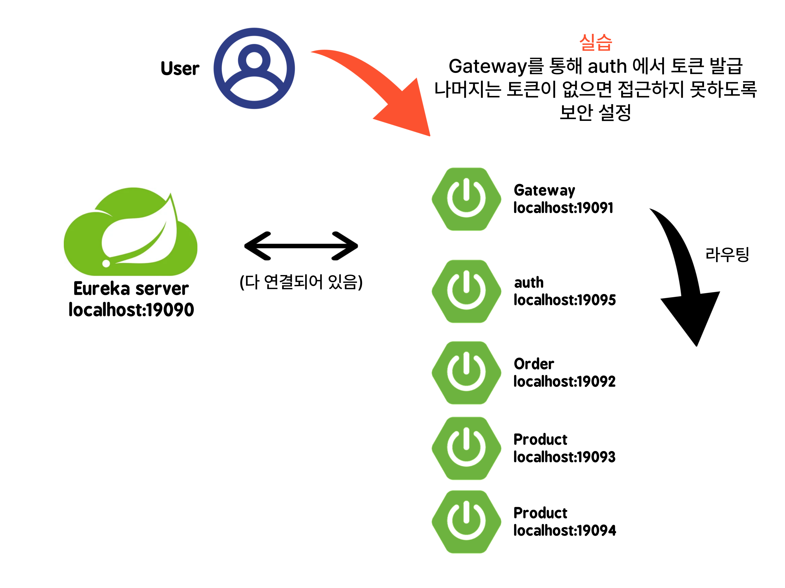
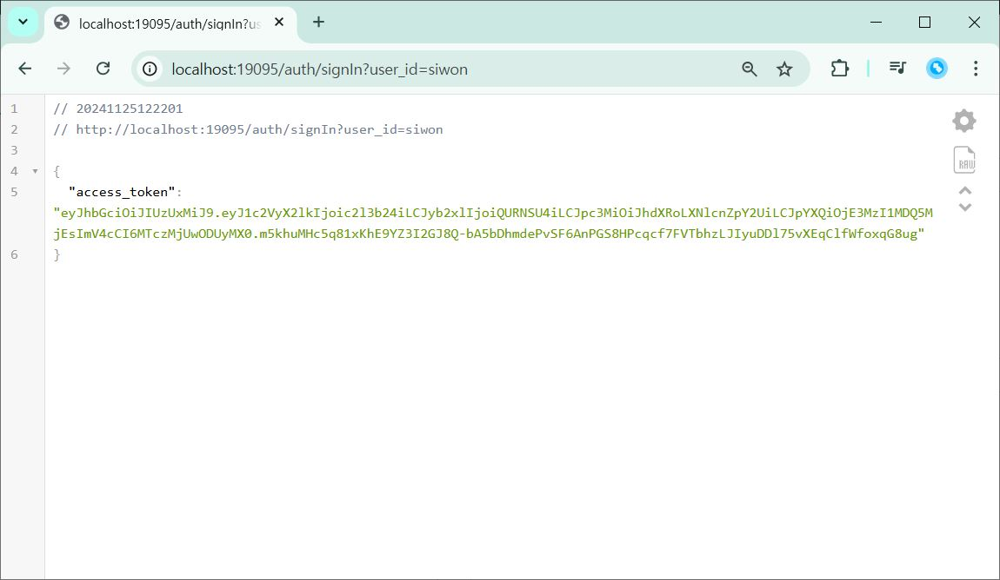
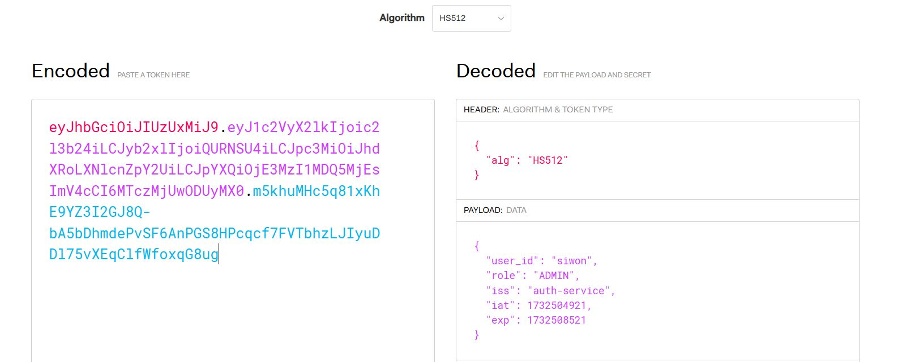
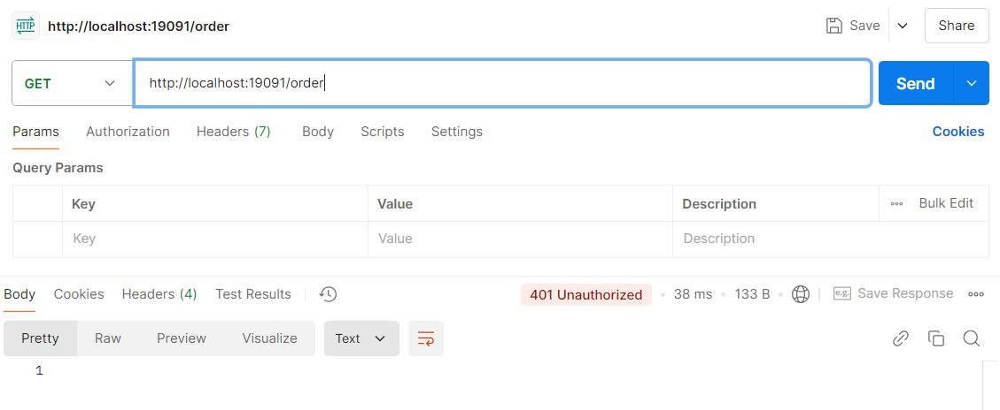
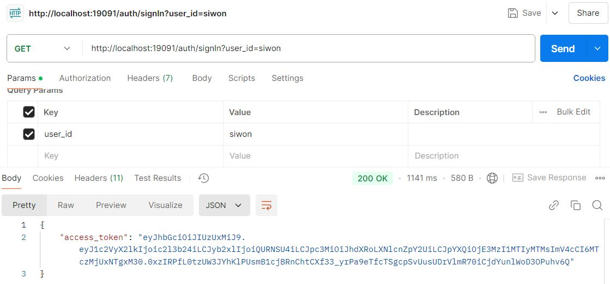
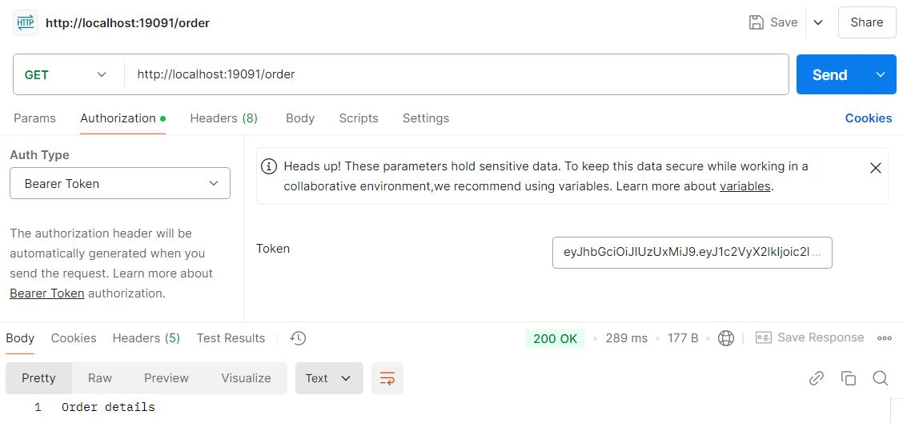

# API Gateway API 게이트웨이
- 여러 개의 마이크로서비스에서 제공하는 API를 단일 진입점으로 노출시켜 주는 역할
## Spring Cloud Gateway
- Spring Cloud Netflix 패키지의 일부

## OAuth2
- 토큰 기반의 인증 및 권한 부여 프로토콜

### JWT (JSON Web Token)
- JSON 형식 토큰
- 클레임(claim)을 포함하여 사용자에 대한 정보를 전달

## 실습 내용 1 (gateway)

게이트 웨이로 Order, Product 라우팅하는 실습

- 게이트웨이(19091)로 order 호출 확인

- 게이트 웨이(19091)로 product 호출 확인

다시 호출하면 포트 번호가 바뀌어 로드 밸런싱까지 확인 가능!

## 실습 내용 2 (oauth2)

auth service 를 추가해 토큰 생성을 구현하고 다른 서비스에 토큰이 있는 경우에만 접근 가능하도록 설정하고 확인하는 실습

- 엑세스 토큰 발급 확인

- 토큰 안에 정보가 저장된 것을 확인

- 토큰 없이 Order 요청 (실패)

- 토큰 발급 후 헤더에 포함해 Order 요청 (성공)

