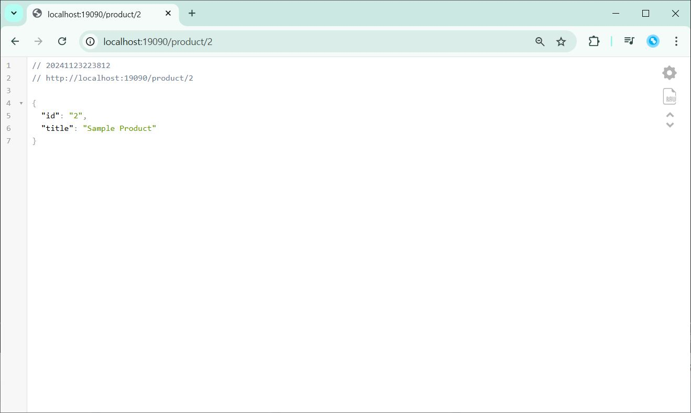
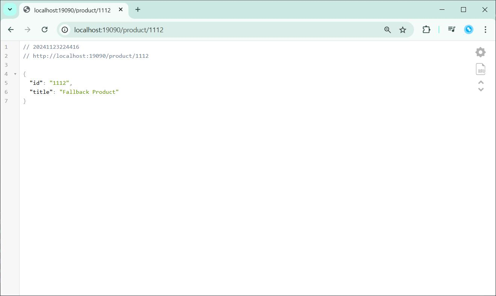
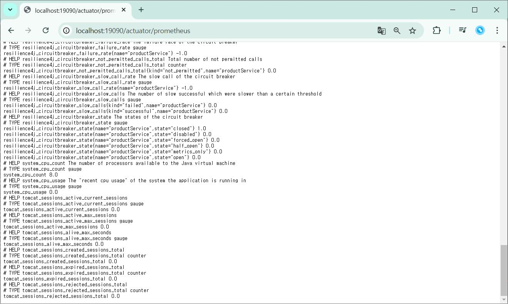

# Circuit Breaker 회로 차단기
- 마이크로서비스에서 일시적으로 문제가 발생하여 서비스가 다운될 때, 다운된 서비스에 대한 요청을 차단하고 다른 대체 서비스를 호출하는 기능
- 호출 실패 시 장애를 격리해 다른 부분에 영향이 가지 않도록 함

## Resilience4j
- 서킷 브레이커 라이브러리
- 서비스 간의 호출 실패를 감지하고 시스템의 안정성을 유지
- 다양한 서킷 브레이커 기능을 제공
- Fallback: 호출 실패 시 대체 로직을 제공하여 시스템 안정성 확보
- Closed, Open, Half-Open 상태를 통해 호출 실패를 관리

### 상태
Closed:
- 기본 상태로 모든 요청이 통과됨
- 호출이 실패하면 실패 카운터가 증가
- 실패율이 설정된 임계값을 초과하면 Open 상태로 전환

Open:
- 모든 요청이 차단되어 바로 에러 응답을 반환
- 설정된 대기 시간이 지나면 Half-Open 상태로 전환

Half-Open:
- 제한된 수의 요청을 허용하여 시스템이 정상 상태로 복구되었는지 확인
- 요청이 모두 성공하면 Closed 상태로 전환
- 실패하면 다시 Open 상태로 전환

## 실습 내용
### Resilience4j 으로 서킷 브레이커 동작 확인
111을 보내면 오류가 발생하도록 설정

- 정상 요청

- 오류 상황(111)을 요청할 경우 설정한 fallback 응답 반환

- 오류 상황을 여러번 요청할 경우 서킷 브레이커 상태가 Open 이 되면서 정상 요청도 전부 에러 응답이 반환

- 시간이 지나고 Half-Open 로 변경된 상태에서 지정한 수의 요청을 모두 성공시켜 Cloed 상태로 변경, 다시 정상적으로 응답이 되는 것을 확인

- 프로메테우스에 정보가 수집된 것을 확인

