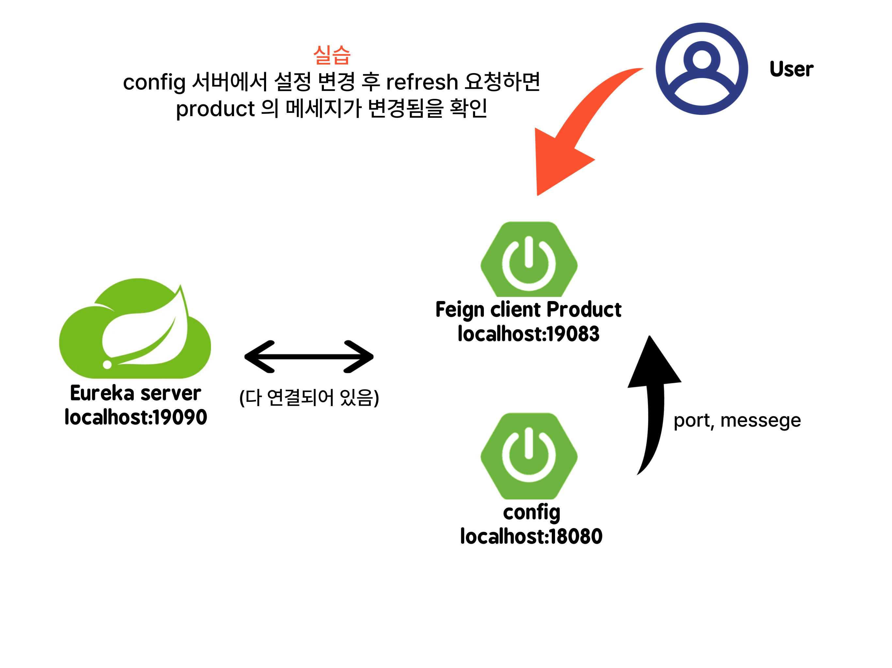
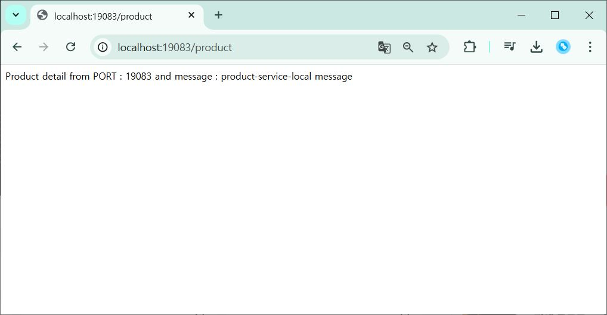
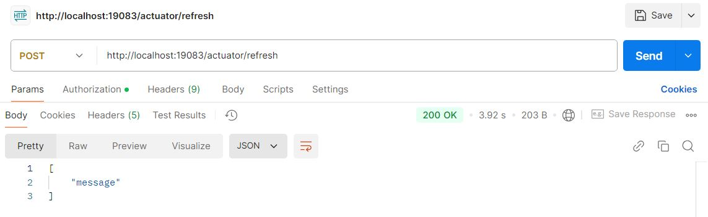
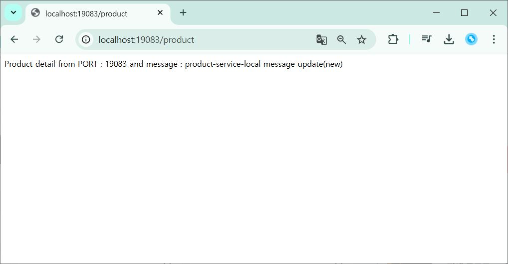

# Distributed Configuration 분산 설정
- 마이크로서비스에서 필요한 설정 정보를 중앙에서 관리하고, 변경사항을 런타임 중에 적용할 수 있는 기능

## Spring Cloud Config
- 분산 시스템 환경에서 중앙 집중식 구성 관리를 제공하는 프레임워크
- 애플리케이션의 설정을 중앙에서 관리하고, 변경 사항을 실시간으로 반영할 수 있음

## 실습 내용

게이트 웨이로 Order, Product 라우팅하는 실습

- product 요청으로 메세지 확인

- config 에서 메세지 바꾼 후 refresh 요청

- 다시 product 요청을 보내 메세지가 바뀐 것을 확인
