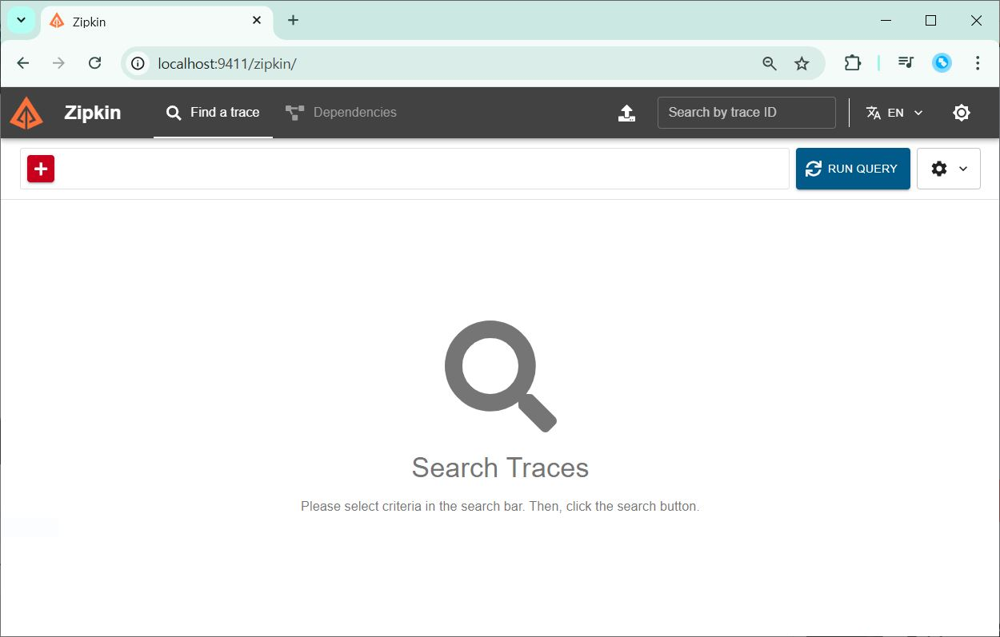
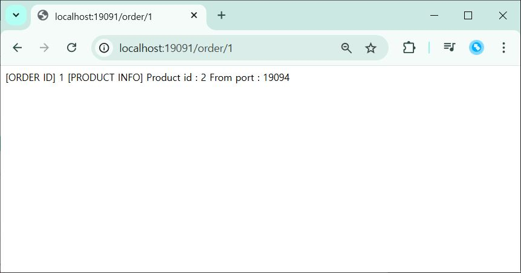
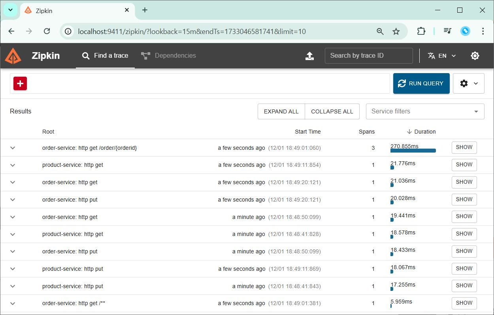
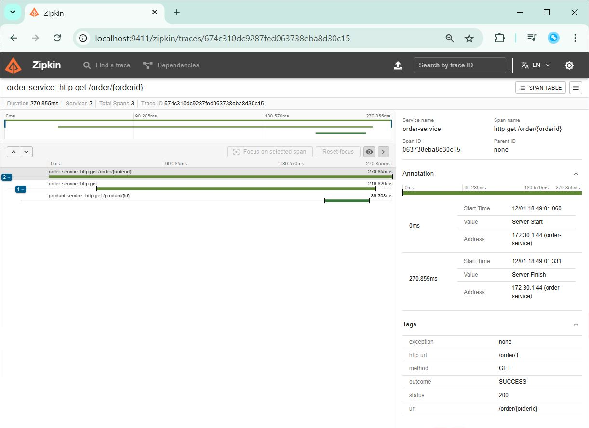
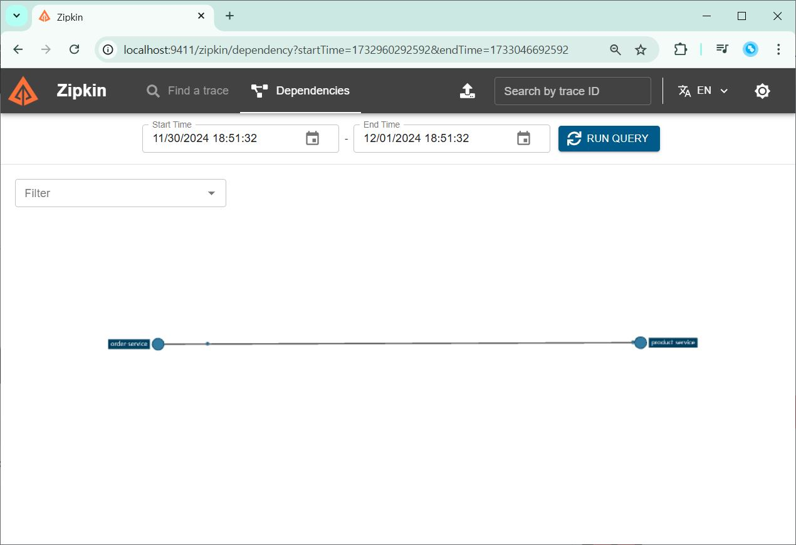

# Distributed Tracing 분산 추석
분산 시스템에서의 트랜잭션 추적을 위한 기능

## Zipkin


## 실습 내용
### Zipkin 정보 확인 실습

- build.gradle 에 zipkin 관련 의존성 추가
- 도커에서 zipkin 실행
```Shell
docker run -d -p 9411:9411 openzipkin/zipkin
```
- zipkin 처음 화면


- order 요청 


- 요청 후 zipkin 확인


