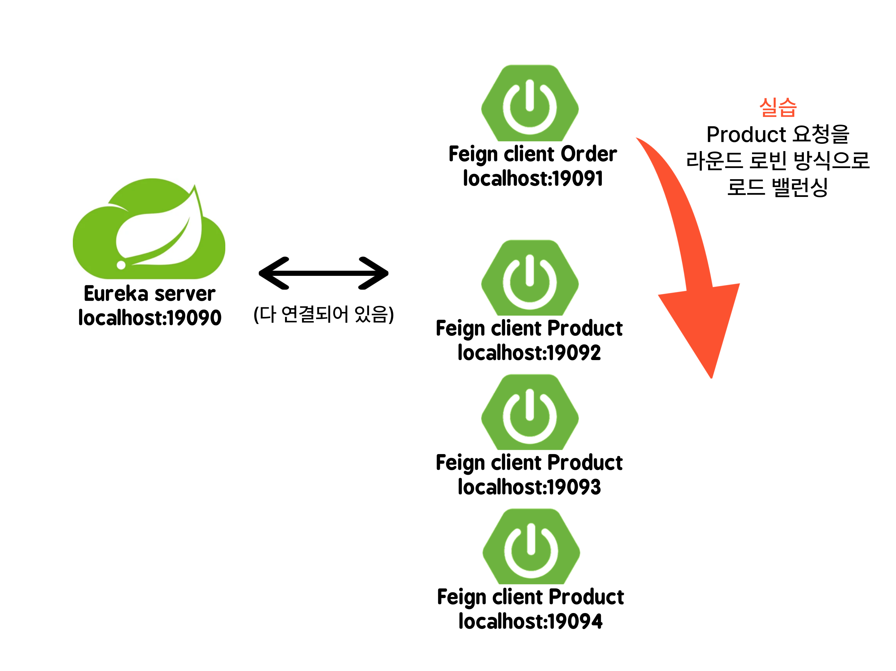
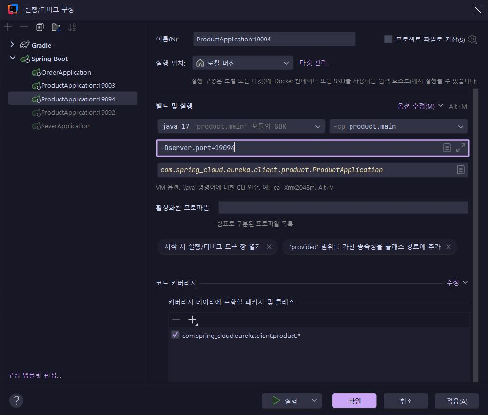
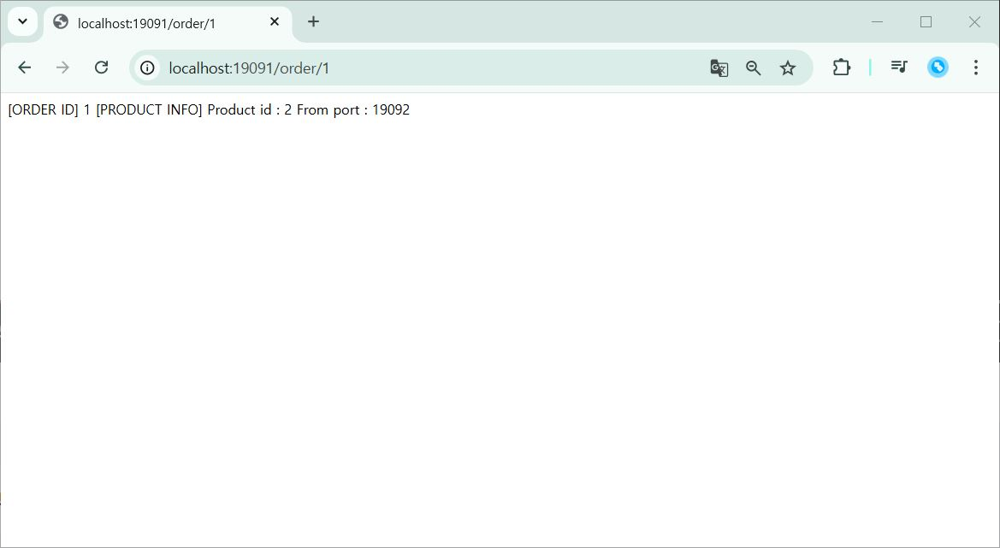
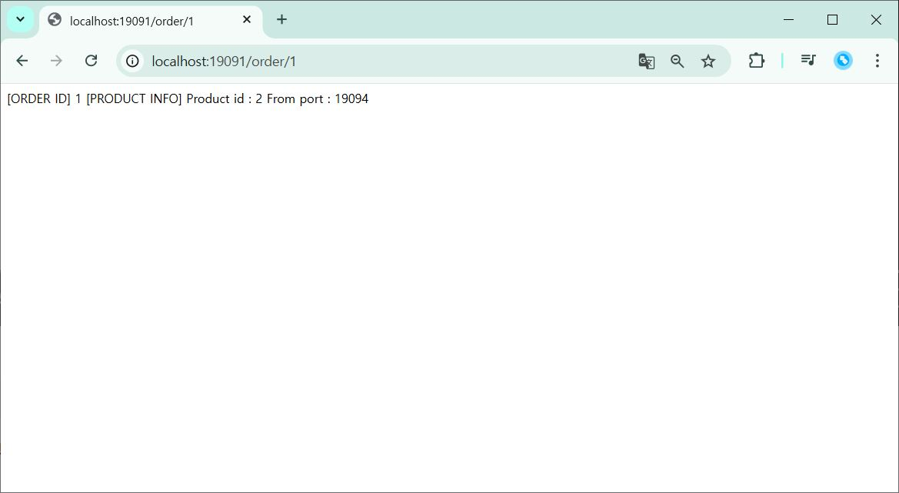

# Load Balancing 로드 밸런싱

- 네트워크 트래픽을 여러 서버로 분산시켜 서버의 부하를 줄이고, 시스템의 성능과 가용성을 높이는 기술
- 서버 사이드 로드 밸런싱, 클라이언트 사이드 로드 밸런싱, DNS 기반 로드 밸런싱 등 여러 종류를 가지고 있음

## FeignClient
- Spring Cloud 에서 제공하는 선언적 웹 서비스 클라이언트
- Eureka와 같은 서비스 디스커버리와 연동하여 동적으로 서비스 인스턴스를 조회하고 로드 밸런싱을 수행
- 인터페이스와 어노테이션을 사용하여 REST API를 호출할 수 있음
- 내부에 Ribbon이 통합되어 있어 자동으로 로드 밸런싱을 수행

### Ribbon
- 넷플릭스가 개발한 클라이언트 사이드에서 로드 밸런싱을 지원하는 도구
- 라운드 로빈, 가중치 가반 등 다양한 로드 밸런싱 알고리즘을 지원

## 실습 내용
### 클라이언트가 서버의 목록을 가지고 이를 바탕으로 로드 밸런싱을 수행해 서버를 선택하는 형태의 클라이언트 사이드 로드 밸런싱을 실습

Eureka server 하나에 주문 클라이언트와 포트 번호만 다르고 같은 상품 인스턴스 여러개를 연결, Order 쪽으로 요청을 보내면 Order 에서 Product server 에서 상품 정보를 받아오는 과정에서 Ribbon의 라운드 로빈 알고리즘으로 로드 밸런싱이 되는 것을 확인해본다.

```Groovy
implementation 'org.springframework.cloud:spring-cloud-starter-openfeign'
```

- 포트 번호만 다르게 같은 Product 클라이언트 추가

옵션 수정 - VM 옵션 추가 - -Dserver.port으로 포트를 다르게 지정

- Eureka server - Order server - Product server 실행


- 주문 요청


- 다시 요청


포트 번호가 19092 에서 19094 로 바뀌어 로드 밸런싱이 되는 것을 확인!